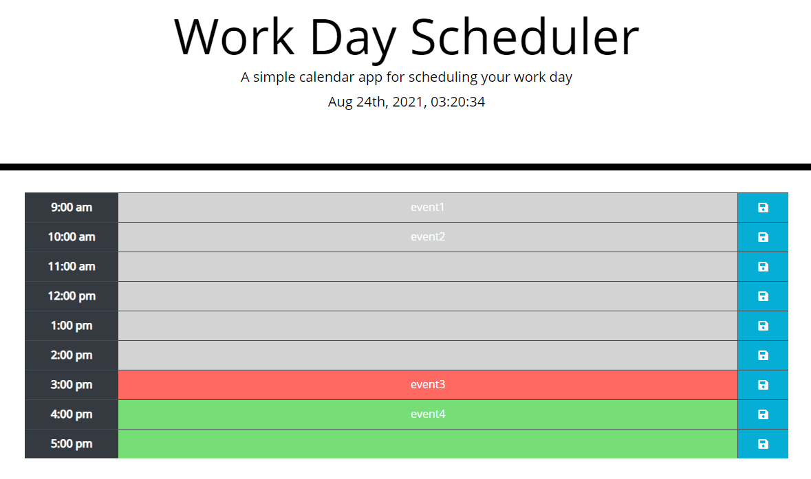

# Work Day Scheduler

## Link to public repo on Github:

https://github.com/jcapadocia3/Work-Day-Scheduler

## Link to public Github page URL:

https://jcapadocia3.github.io/Work-Day-Scheduler/

## Final webpage project image:

## About Project

This project is intended to present a user with a scheduler to utilize for his/her responsibilities for the current day. The web page is dynamically interactive for the user to enter/delete data and save it to the scheduler as needed. Entered/Deleted (if saved) input will be stored for the user to reference as needed.

### How the project functions

- The user will be presented with a simple calendar interface in which the current date and time will be presented and updated in real-time.

- The user will have the option to click on a corresponding text box next to the hour of day located on the left side of the screen. When a text box is clicked, the user can input an "event/responsibility" that they would have to, presumably, complete by that corresponding hour of day. The user can then click the "save icon" to the right of the text box to ensure their input is saved for reference.

- Text boxes will be color coded based on past (gray), present (red), or future (green) times and will be updated in real-time. This is an indicator that a user can take advantage of to keep track of responsibilities that are overdue, currently due within the hour, or due by the end of business day.

- When a user clicks the "save icon" next to a field where input is entered/deleted, the web page will store the data locally to persist should the user choose to close the web page and reload it in the future to reference his/her responsibilities for the day.
